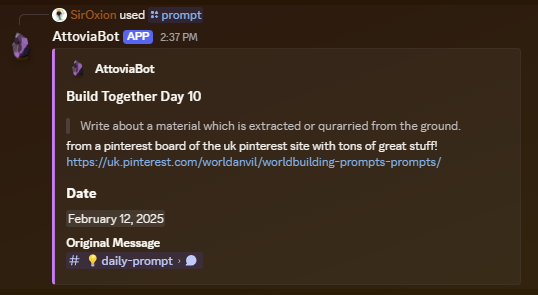

# AttoviaBot
A word counter and potential utility bot for the Attovia discord!
## Text Commands
#### !ab count
Counts the words of the message being replied to. You must be the author of the message being replied to
#### !ab attachments
Counts the words in the attachments of the message being replied to. You must be the author of the message being replied to
#### !ab random prompt
Get a random Build Together prompt
## Slash Commands
#### /countwords
Counts the words in the linked message. Requires a full message link as a parameter.
#### /status
Outputs an embed with the information of the user supplied or of the initial user of the command if no user parameter is supplied.

#### /prompt
Get the Build Together prompt for the day specified.

#### /random-prompt
Get a random Build Together prompt

# Contact
If you have questions about setting something like this up for your own server/community of writers then please feel free to reach out to me here or on discord (siroxion)!